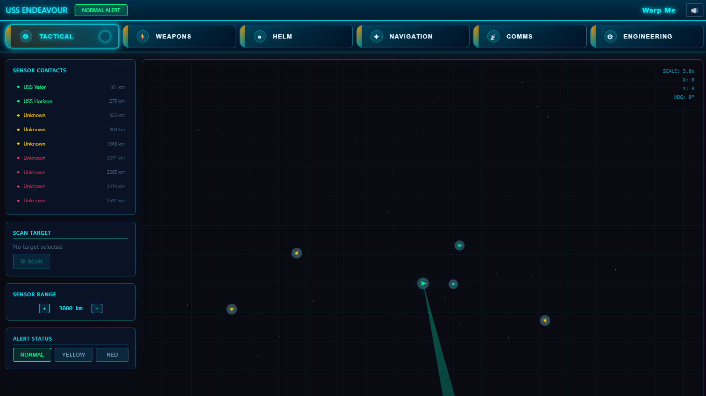

# WarpMe - Starship Bridge Simulator

A browser-based starship bridge simulator inspired by Artemis Starship Bridge Simulator and Star Trek. Built with vanilla HTML, CSS, and JavaScript — no build step required.



## 🚀 Quick Start

### Prerequisites
- A modern web browser (Chrome, Firefox, Edge, or Safari)
- A local web server (ES modules require serving over HTTP)
- **Node.js** (optional, but required for `npx serve`) - Download from https://nodejs.org/ (LTS version recommended)

### Running the Simulator

**Option 1: Using VS Code Live Preview or Live Server (recommended)**
1. Install the "Live Preview" (Microsoft) or "Live Server" extension in VS Code
2. Open [index.html](index.html) and start the live session (via the extension's Start button or context menu)

VS Code will open a local URL in your browser.

**Option 2: Using Python**
```bash
cd WarpMe
python -m http.server 8000
```
Then open http://localhost:8000 in your browser.

**Option 3 (optional): Using npx serve (requires Node.js)**
```bash
cd WarpMe
npx serve
```
Then open http://localhost:3000 in your browser.

### First Steps

1. **Click anywhere** to enable audio (browser requirement)
2. You start at the **Tactical** station with a radar view
3. Use the **tab bar** to switch between bridge stations
4. Friendly ships (green) are nearby, hostiles (red) are at distance
5. Try scanning unknown contacts and setting waypoints!

The top-right header shows the app title "Warp Me" immediately to the left of the mute control for quick orientation.

## 🎮 Bridge Stations

| Station | Purpose |
|---------|---------|
| **Tactical** | Long-range sensors, ship scanning, threat detection |
| **Weapons** | Target lock, phasers, photon torpedoes |
| **Helm** | Ship piloting, throttle, heading control |
| **Navigation** | Star map, waypoint plotting, course setting |
| **Comms** | Hailing frequencies, message log, broadcasts |
| **Engineering** | Power distribution, damage control, repairs |

## 🎯 Workshop Demo Features

This simulator demonstrates several concepts valuable for AI coding workshops:

- **Shared State Management** - Central game state with event-driven updates
- **Canvas Rendering** - Real-time 2D graphics with layered rendering
- **Game Loop Architecture** - Fixed timestep updates with variable rendering
- **AI State Machines** - NPC ships with patrol/approach/attack/flee behaviors
- **Procedural Audio** - Web Audio API for synthesized sound effects
- **Accessible UI** - ARIA-compliant tab navigation
- **CSS Custom Properties** - Themeable LCARS-inspired design
- **ES Modules** - Native browser module system, no bundler needed

## 📁 Project Structure

```
WarpMe/
├── index.html              # Main HTML entry point
├── css/
│   └── main.css            # All styles (LCARS theme)
└── js/
    ├── main.js             # Application bootstrap
    ├── core/
    │   ├── state.js        # Central game state management
    │   ├── simulation.js   # Game loop and physics
    │   ├── renderer.js     # Canvas rendering system
    │   ├── audio.js        # Procedural sound effects
    │   └── scenario.js     # Initial game setup
    └── stations/
        ├── tactical.js     # Tactical station UI
        ├── weapons.js      # Weapons station UI
        ├── helm.js         # Helm station UI
        ├── navigation.js   # Navigation station UI
        ├── comms.js        # Communications station UI
        └── engineering.js  # Engineering station UI
```

## 📖 Documentation

- [Architecture Guide](ARCHITECTURE.md) - System design and code organization
- [Style Guide](STYLE_GUIDE.md) - Visual design system and CSS patterns

## 🎨 Customization

### Changing the Ship Name
Edit `index.html` and find the `.ship-name` element:
```html
<span class="ship-name">USS ENDEAVOUR</span>
```

### Modifying the Starting Scenario
Edit `js/core/scenario.js` to change:
- Number and types of ships
- Starting positions
- Faction distributions
- Initial communications

### Adjusting Colors
All colors are defined as CSS custom properties in `css/main.css`:
```css
:root {
    --color-primary: #00f0ff;
    --color-secondary: #ff9900;
    --color-friendly: #00ff88;
    --color-hostile: #ff3366;
    /* ... */
}
```

## ⌨️ Keyboard Controls

| Key | Action (Helm Station) |
|-----|----------------------|
| `W` / `↑` | Increase throttle |
| `S` / `↓` | Decrease throttle |
| `A` / `←` | Turn port (left) |
| `D` / `→` | Turn starboard (right) |

## 🔊 Audio

- Click the **🔊** button in the top-right to mute/unmute
- Audio state persists across sessions via localStorage
- All sounds are procedurally generated (no audio files needed)

## 🛠️ Development

This project uses:
- **Vanilla JavaScript** with ES Modules
- **CSS3** with Custom Properties and Grid/Flexbox
- **HTML5 Canvas** for rendering
- **Web Audio API** for sound

No npm packages, no build step, no transpilation. Just open and go.

## 📜 License

MIT License - Feel free to use this for workshops, demos, or as a starting point for your own projects.

---

*"Space: the final frontier..."* 🖖
